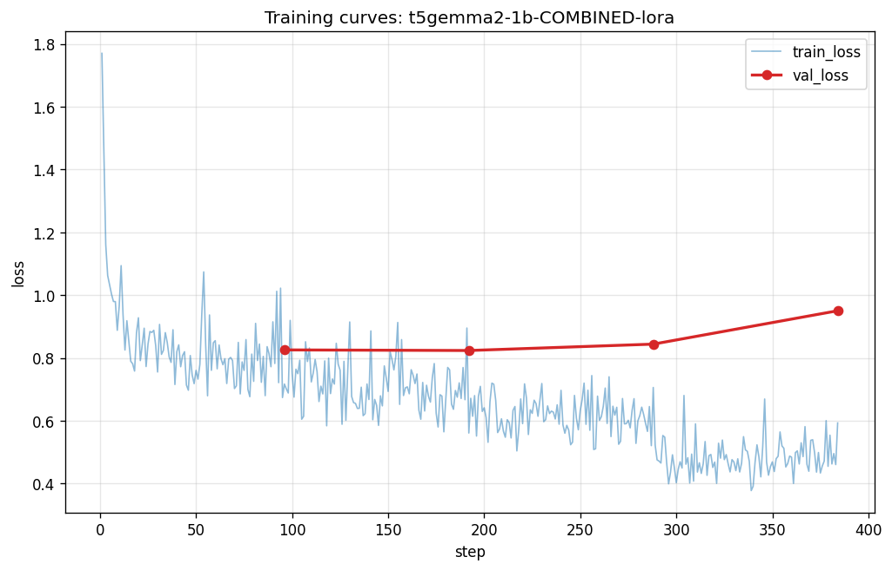

# 학습 결과 요약 — T5Gemma 2 1B casual 변환

본 문서는 보고서/발표용 집계 결과다. 개별 발화(SBCSAE 원문)는 라이선스(CC BY-ND
3.0 US)상 포함하지 않으며, 모두 분포 통계 수치다.

- base: `google/t5gemma-2-1b-1b` (encoder-decoder seq2seq)
- 방식: PEFT LoRA (r=16, bf16, all-linear), batch 1 × grad_accum 16, max_seq 1024, lr 2e-4, seed 42
- 데이터: SBCSAE, speaker-aware split (train/val/test = 1405 / 176 / 176)
- 평가: test split n=176

**최종 모델: `t5gemma2-1b-SBCSAE-lora-repunct`** — target 발화에 자연스러운 구두점을
복원한 **재구두점(repunct) 데이터셋**으로 학습([ADR-0012](../docs/decisions/0012-target-punctuation-normalization.md)).
아래 두 결정(A: target 구두점, B: 학습 길이)이 이 모델을 만든 근거다.

## 결정 A — target 재구두점 (ADR-0012)

직전 baseline(`-es`)은 target에 Tier-A(기계적 정규화)만 적용해 **쉼표가 없고
마침표 앞 공백(`' .'`)이 남아** 있었다. 모델은 학습한 적 없는 부호를 만들 수 없으므로
예측도 같은 증상을 그대로 답습했다. repunct는 target에 쉼표·물음표를 복원하고
`' .'`을 제거해 이 문제를 직접 교정한다.

`-es`와 repunct는 **하이퍼파라미터·학습 길이가 동일(8 epoch, 동일 config)하고
데이터만 다르다** → 아래 차이는 데이터(재구두점) 효과로 단정할 수 있는 단일변수 비교다.

| 부호 지표 (pred mean / item) | `-es` (before) | repunct (after) | human ref |
|---|---|---|---|
| **쉼표 commas** | **0.00** | **4.35** | 3.73 |
| **마침표 앞 공백 `' .'`** | **4.41** | **0.00** | 0.00 |
| 물음표 questions | 0.60 | 0.65 | 0.86 |
| 마침표 periods | 3.96 | 4.23 | 5.25 |
| 느낌표 exclaims | 0.00 | 0.00 | 0.00 |

- **쉼표 복원**: 0 → 4.35로, 사람 ref(3.73) 수준으로 절 경계에 자연스럽게 찍힌다.
- **`' .'` 잔존 제거**: 4.41 → 0. Tier-A 띄어쓰기 아티팩트가 완전히 사라졌다.
- **물음표**도 ref 방향으로 소폭 개선(0.60→0.65). 느낌표는 의도대로 복원하지 않는다.
- ※ `human ref`는 repunct 데이터의 참조(=제대로 구두점 찍힌 사람 발화, ADR-0012의 목표).
  `-es`의 *자기 target*은 쉼표 0·`' .'` 4.x여서, `-es`가 0을 내는 건 버그가 아니라
  그 데이터를 충실히 학습한 결과다 — 즉 데이터를 고쳐야 풀리는 문제였다.

정성 예시는 [`samples.md`](samples.md) 참조 (before/after 쌍).

## spoken-ness 회귀 검증

재구두점은 **단어를 바꾸지 않으므로**(불변식) 구어성 지표는 유지돼야 정상이다.
참조 분포는 두 모델에서 동일(같은 test split, Tier B는 부호만 변경).

| 지표 (mean) | `-es` (before) | repunct (after) | reference |
|---|---|---|---|
| length ratio (pred/ref) | 0.95 | 0.96 | — |
| tokens | 56.5 | 57.0 | 67.8 |
| fillers / item | 1.97 | 2.13 | 2.16 |
| pause:short / item | 2.31 | 2.14 | 3.48 |
| pause:long / item | 2.80 | 2.42 | 4.63 |
| lexical density | 0.428 | 0.428 | 0.428 |

길이·lexical density는 사실상 동일, filler는 오히려 ref(2.16)에 더 근접(1.97→2.13)했다.
pause는 0.2~0.4 감소했으나 ref 대비 양쪽 다 과소이며 차이가 작아(bf16 비결정성 범위)
유의미한 회귀로 보지 않는다. **구두점을 고치면서 구어성은 해치지 않았다.**

## 결정 B — 학습 길이 (방법론 노트)

repunct 이전, 동일 Tier-A 데이터에서 학습 길이만 달리한 두 체크포인트를 비교했다.

| 항목 | 1-epoch (`-eos`) | early-stopped (`-es`, epochs=8, patience=2) |
|---|---|---|
| 실제 학습 | 1 epoch | epoch 4에서 조기종료, best=epoch 2 |
| train_loss | 0.795 | 0.622 |
| best eval_loss | — (eval 미실행) | 0.702 |
| train_runtime | ~2103s (~35min, RTX 4060 8GB) | ~8357s (~139min) |

**`eval_loss`(teacher-forced 확신도)와 출력 분포 정렬(spoken-ness)은 별개 신호**다.
`-es`는 eval_loss가 더 낮지만 filler/pause를 ref보다 약하게 적용했고, 1-epoch은 loss가
높아도 filler가 ref에 더 가까웠다. 낮은 loss가 reference 분포에 가까운 출력을 보장하지
않는다. (최종 repunct는 8 epoch 설정을 따르되, 위 spoken-ness 표에서 보듯 filler 정렬을
오히려 회복했다.)

---

※ repunct 학습 내역(MANIFEST): epochs=8 설정, early-stop으로 **epoch 4 종료**,
train_loss 0.646, best eval_loss 0.700, runtime ~8352s(~139min, Kaggle T4), n_train/val
= 1405/176. → `-es`(train_loss 0.622, eval_loss 0.702, 동일 epoch 4 종료)와 학습 동역학이
사실상 동일하다. 동일 config·데이터만 다르므로 차이는 학습 곡선이 아니라 출력 부호
분포에서만 나타난다(결정 A).

---

# 통합 학습 — 스타일 제어 토큰 분기 (casual + semi_formal)

casual(SBCSAE repunct, 1,757) + semi_formal(AMI, 2,055)을 하나의 데이터셋으로
합쳐 학습해, 제어 토큰(`<style:casual>` / `<style:semi_formal>`)이 두 스타일을
실제로 분기시키는지 검증한다.

- 모델: `t5gemma2-1b-COMBINED-lora` (어댑터 `aip-scripttuner-team/scripttuner-t5gemma2-1b-combined`)
- 데이터: speaker-aware split (train/val/test = 3,049 / 382 / 381, 화자 누수 0)
- 학습: 동일 config(LoRA r=16, bf16, batch 1×grad_accum 16, max_seq 1024), epochs=8 설정,
  early-stop으로 epoch 4 종료, best eval_loss 0.824 (Kaggle T4)

## 분기 검증 — paired generation

같은 입력(formal_text) 100건에 **style 토큰만 바꿔** 양쪽을 생성하고 두 출력군의
분리도(Cohen's d, semi_formal − casual 부호)를 측정한다. 같은 입력이므로 코퍼스
교란 없이 순수 토큰 효과만 본다.

| 피처 (paired, n=100×2) | casual | semi_formal | Cohen's d | verdict | 기대방향 |
|---|---|---|---|---|---|
| **tokens_per_sentence** | 14.1 | 17.3 | **+0.33** | ✓ | 일치 |
| pause_rate | 0.179 | 0.000 | −2.85 | (제외) | 일치 |
| filler_rate | 0.038 | 0.044 | +0.18 | ✓ | 불일치 |
| lexical_density | 0.436 | 0.430 | −0.08 | ✓ | — |
| phrasal_verb_ratio | 0.075 | 0.070 | −0.04 | ✓ | 일치 |

**판정: 분리됨(collapse 아님).** 핵심 분리 축은 **문장 분절(`tokens_per_sentence`)** —
semi_formal은 절을 길게 이어붙이고(문장당 17.3단어), casual은 짧게 토막낸다(14.1).
보조로 casual만 pause를 방출한다(semi_formal은 0).

- **`tokens_per_sentence`가 verdict를 끈다**(d=+0.33 > 0.2 임계). filler/lexical/phrasal만으로는
  이 "발화 리듬" 차이를 못 잡아 collapse로 오판된다 → 분절 축을 verdict에 추가했다
  ([`style_separation.py`](../scripttuner/training/style_separation.py)).
- **pause는 verdict에서 제외**한다 — AMI(NXT)에 pause 표기가 없어 발생하는 코퍼스
  아티팩트이지 모델이 학습한 register 신호가 아니다(전체 d에는 리포트).
- **filler_rate는 기대와 반대**(semi_formal이 더 높음). 이는 AMI 회의 발화의 머뭇거림이
  SBCSAE 일상 대화보다 많은 **장르 차이**이지 격식 신호가 아니다 — register 지표로 보지 않는다.

정성 예시는 [`samples.md`](samples.md) 참조 (동일 입력 casual vs semi_formal 쌍).

